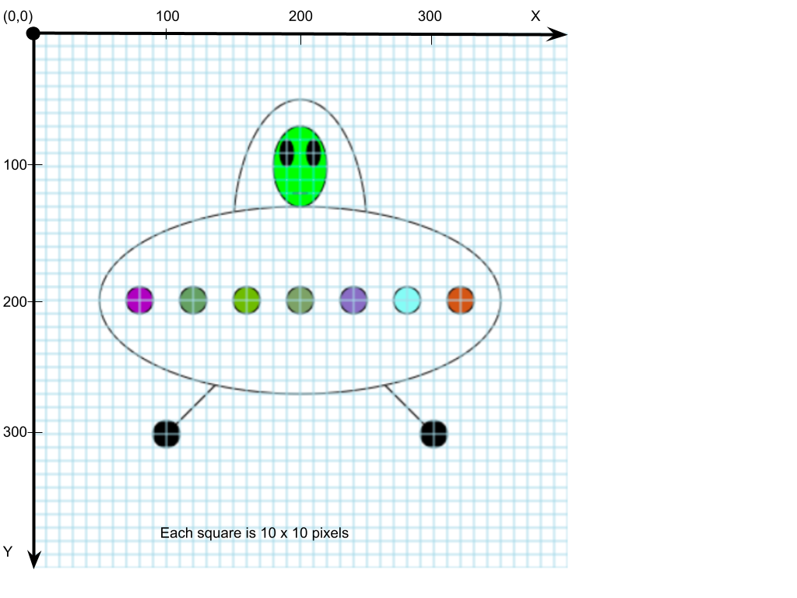

# ZoogShip

Your task is to recreate the ZoogShip image below as accurately as possible.

1)  Mark up the paper copy of the ZoogShip so that you know the positions (x and y values) of the different shapes.  The UFO light colors don't matter other than they should all be different.

2) Clone your project from here: [https://github.com/bradleecrockett/Zoogship](https://github.com/bradleecrockett/Zoogship)  then write the code using your marked up ZoogShip paper in class (ignore the colors for now).   
3) Watch the video: [https://youtu.be/riiJTF5-N7c](https://youtu.be/riiJTF5-N7c) or  [https://youtu.be/UFvuzapdlTY](https://youtu.be/UFvuzapdlTY) about colors in P5JS until you have enough information to properly color the ZoogShip.  
4) Submit a `.zip` folder of your completed work.

Video about using random(): [2.4: random() Function - p5.js Tutorial](https://youtu.be/POn4cZ0jL-o)